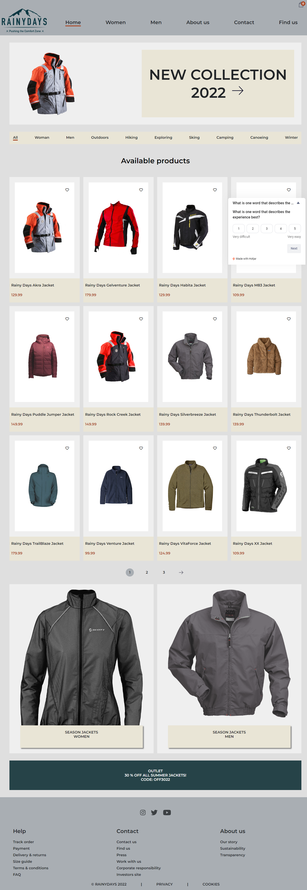
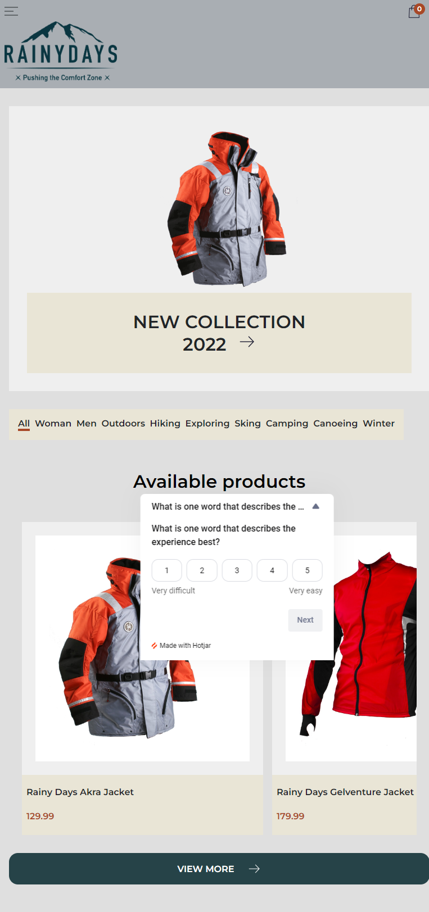
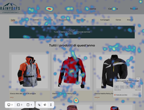
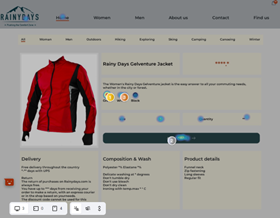

# Rainydays website

<!-- A simple overview of use/purpose. -->

The `Rainydays` website is a e-commerce shop for sport and outdoors jackets.

The original website without API is hosted at the following url:
<https://luxury-halva-7c3f63.netlify.app>

Website used in usability testing before implementation (main branch) link:
<https://glistening-hummingbird-317e80.netlify.app/>

Website after some implementations (improvements branch) link:
<https://improvements--glistening-hummingbird-317e80.netlify.app/>

Assignment:

- [Brief](CA-brief.pdf)

## Description

<!-- An in-depth paragraph about your project and overview of use. -->

The main goal of this repository is identify usability problems.
In order to test the usability of `Rainydays website` I followed these steps:

- I planed the test,
- recruited 4 participants,
- runed the usability tests,
- analized test data,
- implemented some cahnges,
- runed the usability tests again,
- tested the site's accessibility (`WAVE `tool);

## Quantitative test

I installed the Hotjar tool and started capturing the data necessary for the quantitative test.
I choose to collect data through filters, `heatmaps` and `recordings` to track user behavior.

## Qualitatie test

This test was very important because I could test critical aspects of the site such as:

- purchasing a jacket,
- filling out the contact form,
- checking the use of menus,
- etc;

As a result, I gained some insights and categorized problems into different groups:

- searching & filtering,
- navigation,
- product details,
- cart editing,
- form validation & user feedback.

## Analize test data

Therefore, due to time constraints, I chose to prioritize and implement only the most important parts of the website.

- a dynamic shopping cart,
- editable shopping cart,
- an improved error handling in the contact form,
- ability to set a product as “favorite”,
- bigger clickable areas – hyperlinks in other elements in addition to the product title,
- remove details not supported by APIs.

The website interaction implementation has been made with `JavaScript`.

## Conclusion

Overall, I found this project challenging but very useful, especially when improving the website.
I learned to plan better and carry out quantitative and qualitative usability tests.
I was also able to practice what we studied in the project modules.

Additionally, I learned that it’s very important to write html code in a way that is easy to integrate with Javascript. The “Rainydays” website was my first html coding project and – sadly - the code is written in a way that makes it difficult to add dynamic content. This forced me to make some tradeoffs to implement the user suggestions.

I'm very impressed to discover that user experience (UX) is as important as user interface (UI) in the design process.
Without UX it is very difficult to know exactly what the user really wants and why they want it.
Some feedback was very interesting, users have different needs and are focused on different details. For example, the feedback about the missing “product availability” pointed out to me that I didn’t think about everything as I thought.
It was also a really good training to gain the confidence to be face to face with people as they see our work.
In the end, I think the site turned out really well and I was very happy with the result.

## Dependencies

<!-- - Describe any prerequisites, libraries, OS version, etc., needed before installing the program.
- ex. Windows 10 -->

To develop the website I have used `Visual Studio Code` with `Prettier` formatter extension.

No other tools are required to compile or run the website.

The Figma prototypes from the previous CA:

- [Figma Mobile prototype](https://www.figma.com/proto/o9Y8vfut7qEa2hOQ5RBPBm/Design1_FP?page-id=924%3A505&node-id=1139%3A899&viewport=472%2C109%2C0.34&scaling=min-zoom&starting-point-node-id=1139%3A899&show-proto-sidebar=1)
- [Figma Desktop prototype](https://www.figma.com/proto/o9Y8vfut7qEa2hOQ5RBPBm/Design1_FP?page-id=924%3A506&node-id=1139%3A1932&viewport=796%2C261%2C0.11&scaling=scale-down&starting-point-node-id=1139%3A1932&show-proto-sidebar=1)

NB. The implemented website version is slightly different, because few improvements to the Figma/design files were made based on the `Design course` feedbacks from the Tutor.

### References

Books:

- by Alan Cooper, 2014. About Face: The Essentials of Interaction Design Paperback,
- how to make duplicate and clone template/cloneNode() method: <https://www.w3schools.com/tags/tag_template.asp>

- flexbox guide: <https://css-tricks.com/snippets/css/a-guide-to-flexbox/>
- css grid guide: <https://css-tricks.com/snippets/css/complete-guide-grid/>
- css selectors reference: <https://www.w3schools.com/csSref/css_selectors.php>
- Hamburger menu based on `HTML and CSS Task 3.4`: <https://vimeo.com/481725388/ee9b0cfbc3>
- How to overlap grid items: <https://mastery.games/post/overlapping-grid-items/>
- Plugin for extra image [about us]: https://unsplash.com/
